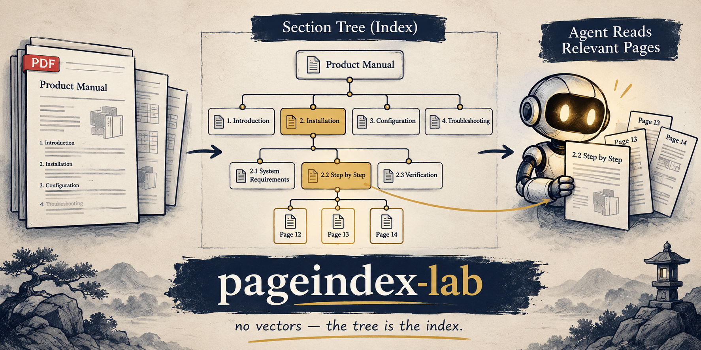

# pageindex-lab

[](https://github.com/dineshkrishna9999/pageIndex-lab)

Try [PageIndex](https://github.com/VectifyAI/PageIndex) locally with an ADK agent.

<p align="center">
  
</p>

<p align="center"><em>no vectors — the tree is the index</em></p>

## Idea

```text
Vector RAG:  PDF → chunks → embeddings → similar chunks
PageIndex:   PDF → section tree → agent picks pages → read those pages
```

## Setup

```bash
uv sync
cp .env.example .env   # fill in llm (api_version >= 2025-03-01-preview)
```

In the Dev Container, `poe` is aliased to `uv run poe`. Locally you can add:

```bash
alias poe='uv run poe'
```

### `.env`

```bash
llm={"model_name": "azure/gpt-4.1", "provider_args": {"api_key": "...", "api_base": "https://....openai.azure.com", "api_version": "2025-03-01-preview"}}
```

`model_name` is a LiteLLM string. Swap provider as needed.

## Try

```bash
poe agent
```

Open the UI, select **agent**, then e.g.:

```text
Index sample_pdfs/pageindex_demo.pdf and summarize it.
```

## Layout

```text
settings.py      load llm from .env
agent/           ADK agent + PageIndex tools
sample_pdfs/     sample PDF
assets/          README diagram
.env.example
```

## License

MIT — see [LICENSE](LICENSE).
